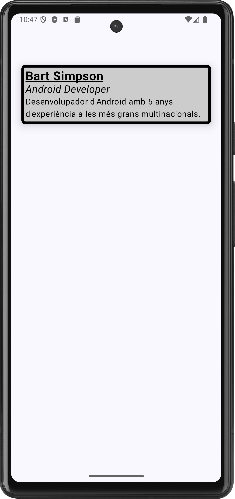

# Android App with component Card
## Language
Kotlin with JetPack Compose

## Purpose
This app is a demo showing the component **Card**

## The expected result is:

## Source code:
The source code of the app can be found [here](app/src/main/java/com/example/componentcard/MainActivity.kt)
